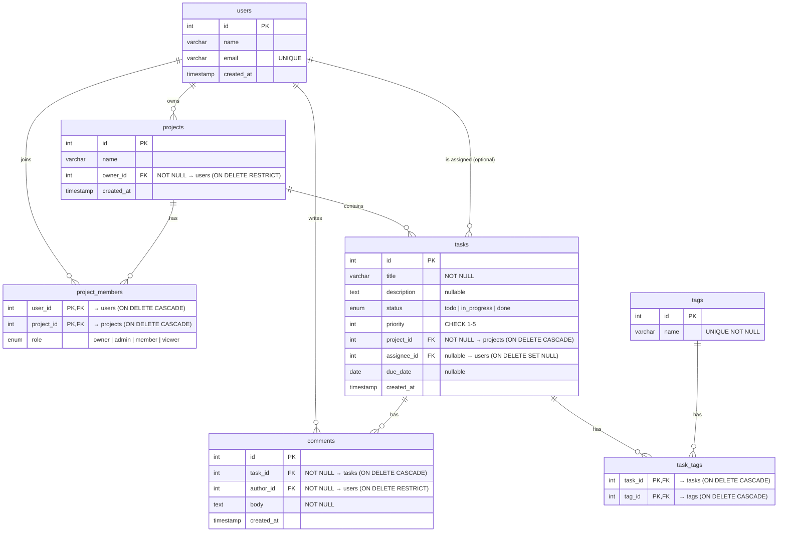
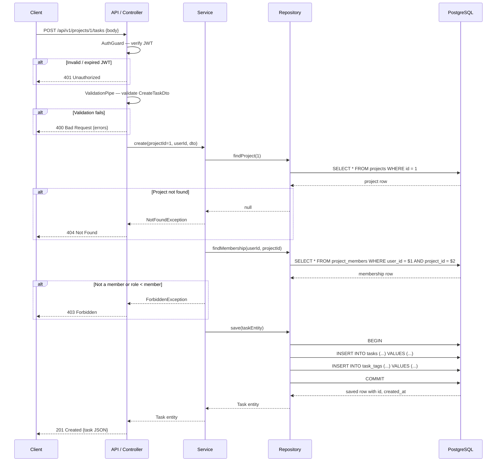

# Task Management Platform — System Design Document

## 1. Overview and Requirements

The Task Management platform is a multi-tenant, role-based project-tracking system that lets teams organise work into projects, assign tasks to members, categorise tasks with tags, and discuss progress through comments. The domain centres on seven relational entities — users, projects, project memberships, tasks, tags, the task–tag join table, and comments — persisted in PostgreSQL and accessed through a NestJS REST API that a Next.js frontend consumes.

### Functional Requirements

- **FR-1 Task lifecycle.** An authenticated user can create a task inside a project they belong to, assign it to any project member (or leave it unassigned), set a priority (1–5) and an optional due date, and move it through `todo → in_progress → done`.
- **FR-2 Tagging and filtering.** A user can attach one or more tags to a task and later filter a project's task list by tag, status, assignee, or priority so that large backlogs remain navigable.
- **FR-3 Commenting.** Any project member can post a comment on a task and retrieve the full comment thread in chronological order, enabling asynchronous discussion without leaving the platform.

### Non-Functional Requirements

- **NFR-1 Response latency.** Every list endpoint must return its first page in ≤ 200 ms at the 95th percentile when the database holds up to 10 000 tasks, measured at the API gateway.
- **NFR-2 Availability.** The system targets 99.5 % uptime per calendar month, with zero data loss on any single-node failure, achieved through automated database backups and connection-pool health checks.
- **NFR-3 Security.** All endpoints except `POST /api/v1/auth/register` and `POST /api/v1/auth/login` require a valid JWT. Role-based access control (owner / admin / member / viewer) is enforced at the service layer, and no API response ever exposes `password_hash` or raw refresh tokens.

---

## 2. Entity-Relationship Diagram

The ERD below covers the fixed seven-table domain from section 2.1 of the programme brief. Authentication columns (`password_hash` on `users`, the `refresh_tokens` table) arrive in Phase 4 and are deliberately excluded.



**Key points:**

- `project_members` has a **composite primary key** `(user_id, project_id)` — no surrogate `id` column.
- `task_tags` has a **composite primary key** `(task_id, tag_id)` — it is the join table for the many-to-many between `tasks` and `tags`.
- `tasks.assignee_id` is **nullable** (`ON DELETE SET NULL`), allowing unassigned tasks.
- `projects.owner_id` uses `ON DELETE RESTRICT` — you cannot delete a user who owns a project.
- `comments.author_id` uses `ON DELETE RESTRICT` — you cannot delete a user who has authored comments.

---

## 3. Architecture

The system follows a **four-layer architecture**. Each layer has a single responsibility, and data crosses layer boundaries only through typed objects (DTOs inward, entities or view-models outward).

| Layer | Technology | Responsibility |
|---|---|---|
| **Client** | Next.js (React) | Renders UI, captures user input, sends HTTP requests, holds transient UI state |
| **API (Controller)** | NestJS controller | Accepts HTTP requests, validates input (DTOs + class-validator), maps to service calls, returns HTTP status codes |
| **Service** | NestJS injectable | Business logic, authorisation checks (role guard), orchestrates repository calls, throws typed exceptions |
| **Repository** | TypeORM repository | Translates service calls into SQL (QueryBuilder / `find`), manages transactions, returns entities |
| **Database** | PostgreSQL 16 | Stores rows, enforces constraints (PK, FK, CHECK, UNIQUE, ENUM), runs indexes |

### Trace: "Create a Task"

Below is the step-by-step path a `POST /api/v1/projects/1/tasks` request takes through every layer.

**1 → Client.** The user fills in the new-task form (title, description, priority, assignee, due date, tags) and clicks "Create". The frontend assembles a JSON body and sends:

```
POST /api/v1/projects/1/tasks
Authorization: Bearer <access_token>
Content-Type: application/json

{
  "title": "Upgrade PostgreSQL to 16",
  "description": "Past its due date and still open.",
  "status": "todo",
  "priority": 5,
  "assigneeId": 4,
  "dueDate": "2026-09-10",
  "tagIds": [5, 3, 6]
}
```

**2 → API / Controller.** `TasksController.create()` receives the request. NestJS pipes run `class-validator` on the body against `CreateTaskDto`, which enforces: `title` is a non-empty string, `status` is one of the enum values, `priority` is an integer 1–5, `assigneeId` is an optional integer, `dueDate` is an optional ISO date string, and `tagIds` is an optional array of integers. If validation fails → **400 Bad Request**. The `AuthGuard` has already extracted the JWT and attached the user to the request. The controller calls `this.tasksService.create(projectId, userId, dto)`.

**3 → Service.** `TasksService.create()` runs the business rules:

1. Load the project from the repository. If it does not exist → throw `NotFoundException` → **404**.
2. Check the caller's membership and role. If they are not at least a `member` on this project → throw `ForbiddenException` → **403**.
3. If `assigneeId` is provided, verify the assignee is a member of the same project. If not → **400**.
4. If `tagIds` are provided, load the tags from the tag repository. If any id is not found → **400**.
5. Build a `Task` entity, attach the relations, and pass it to the repository.

**4 → Repository.** `TaskRepository.save(task)` opens a transaction (if tags are attached, to write both `tasks` and `task_tags` atomically), executes the `INSERT`, and returns the saved entity with its generated `id` and `created_at`.

**5 → Database.** PostgreSQL enforces the constraints: `project_id` FK exists, `assignee_id` FK exists or is NULL, `priority` passes the `CHECK (priority BETWEEN 1 AND 5)`, `status` matches the `task_status` enum. Any violation rejects the INSERT.

**6 ← Response unwinds.** The repository returns the entity → the service returns it → the controller maps it to a response DTO (stripping internal fields) and responds:

```
HTTP 201 Created
Location: /api/v1/projects/1/tasks/16

{
  "id": 16,
  "title": "Upgrade PostgreSQL to 16",
  "description": "Past its due date and still open.",
  "status": "todo",
  "priority": 5,
  "projectId": 1,
  "assigneeId": 4,
  "dueDate": "2026-09-10",
  "tags": [
    { "id": 5, "name": "urgent" },
    { "id": 3, "name": "backend" },
    { "id": 6, "name": "tech-debt" }
  ],
  "createdAt": "2026-09-02T10:30:00.000Z"
}
```

### Failure mapping

| Failure | Layer that catches it | HTTP status |
|---|---|---|
| Missing / malformed field in body | Controller (class-validator) | 400 Bad Request |
| Invalid or expired JWT | AuthGuard (controller layer) | 401 Unauthorized |
| Caller is not a project member, or role too low | Service (role check) | 403 Forbidden |
| Project not found | Service | 404 Not Found |
| Database constraint violation (duplicate, FK) | Repository → bubbles to service | 400 or 409 Conflict |

---

## 3.1 Sequence Diagram — "Create a Task" (X1)



---

## 3.2 Where State Lives (X2)

Not all state belongs in the database. Putting authorisation data only in the client is a classic security hole; putting UI preferences in the database is wasted I/O. The table below maps each piece of state to its home and explains why.

| State | Lives in | Why |
|---|---|---|
| User identity (`id`, `email`, `name`) | **PostgreSQL** `users` table | Source of truth; survives server restarts |
| User's roles per project | **PostgreSQL** `project_members` table | Authorisation decisions must reflect the latest role assignment |
| Task / project / tag / comment data | **PostgreSQL** domain tables | Durable, relational, queried by many users |
| Authenticated user identity (`sub`, `email`) | **JWT access token** (signed, stateless) | Avoids a database lookup on every request; the token is verified by signature, not by a session table |
| User's role claim | **Not in the JWT** — looked up from DB per request | A role change (demoted from admin to viewer) takes effect immediately. If the role were in the JWT, the user would keep their old privileges until the token expired (up to 15 minutes). The cost is one extra query per authenticated request; the benefit is zero stale-permission window. |
| Refresh token identifier | **PostgreSQL** `refresh_tokens` table | Must be revocable server-side (logout, password change). Storing only a token id in the DB and the full token in an httpOnly cookie means revocation is an `UPDATE` or `DELETE`, not a broadcast. |
| Token expiry, issued-at | **JWT claims** (`exp`, `iat`) | Read by the client to pre-emptively refresh; verified by the server without a DB call |
| Current page / scroll position / open modals | **Client (React state / URL)** | Ephemeral UI state that no other user or session needs to see |
| Filter selections (status, tag, assignee) | **URL query parameters** | Shareable, bookmarkable, survives a page refresh, costs nothing to store |
| Unsaved form draft | **Client (component state)** | Lost on navigation is acceptable; persisting it server-side adds write complexity for no real user benefit at this scale |

**The gap between a role change and token expiry.** When a project owner demotes a user from `admin` to `viewer`, the database reflects the change instantly. Because the JWT does not carry the role, the very next request will read the new role from `project_members`. If the role were baked into the token, the demoted user could still perform admin actions for up to the access-token lifetime (e.g. 15 minutes). This is why the role is always read from the database, despite the extra query.

---

## 4. Non-Functional Plan

### 4.1 Caching

**Cached read: a project's task list** (`GET /api/v1/projects/:projectId/tasks?page=1&status=todo`).

This is the most frequently hit endpoint — every project member sees it on load. The service layer caches the serialised response in a Redis key scoped by `project_id` + query-parameter hash, with a TTL of 60 seconds.

**Invalidating write:** any `INSERT`, `UPDATE`, or `DELETE` on the `tasks` table for that `project_id` evicts all cache keys matching the pattern `tasks:project:<id>:*`. Concretely, `TasksService.create()`, `.update()`, and `.remove()` call `cache.del(tasks:project:${projectId}:*)` before returning.

**Cost accepted:** during the 60-second window a new task or a status change will not appear in other members' list views until the key expires or is explicitly evicted. The evict-on-write strategy keeps the window short (only race conditions between the write and the eviction), but a read that arrives in the milliseconds between the database commit and the cache eviction may still serve stale data. This is acceptable for a project-management UI where eventual consistency within one second does not cause user harm.

**Read that must NOT be cached:** `GET /api/v1/projects/:projectId/members` (the membership list). Role checks depend on this data being current — a cached membership list could let a recently removed user appear authorised. The membership list is small (tens of rows) and queried less often than the task list, so the cost of always hitting the database is negligible.

### 4.2 Scaling

**Read/write split (planned, post-Phase 4).** When traffic justifies it, a streaming read replica is added alongside the primary. The primary handles all writes. The replica handles read-only queries — all list endpoints (`GET .../tasks`, `GET .../comments`, etc.) are routed to the replica by a read-only connection pool in the repository layer. Writes (`INSERT`, `UPDATE`, `DELETE`) go to the primary. Phase 4 ships with a single PostgreSQL node and a Redis cache (§ 4.1) as the first scaling step; the replica is the second step, added when the 99.5 % uptime SLA requires a hot standby (see ADR-002).

**Cost accepted: replication lag.** Streaming replication is asynchronous by default. The replica may lag behind the primary by up to a few hundred milliseconds. This means a user who creates a task and immediately reloads the list might not see their own task yet. The mitigation is "read-your-writes" routing: after a write, the service can tag the user's session to read from the primary for the next 2 seconds. This adds routing complexity but eliminates the most visible symptom of lag.

### 4.3 Consistency

**Enforced at the database.** Foreign keys, `CHECK` constraints, `UNIQUE` constraints, and enum types are enforced by PostgreSQL, not by application code alone. The service layer validates business rules (membership, role), but even if the service has a bug, the database will reject an orphaned task (missing `project_id`), a priority of 9, or a duplicate `(user_id, project_id)` in `project_members`.

**Transactions for multi-table writes.** Creating a task with tags requires inserts into both `tasks` and `task_tags`. These are wrapped in a single transaction so that a tag-insert failure does not leave a task with partially attached tags. The repository layer calls `manager.transaction()` for any write that touches more than one table.

**Cost accepted: lock contention on hot projects.** A project with many concurrent writers (multiple team members creating or updating tasks at the same time) will experience short row-level locks during transactions. On a single primary this limits write throughput on that project. At the current scale (tens of concurrent writers, not thousands) this is not a bottleneck. If it becomes one, the mitigation is to shard projects across databases — but that adds cross-shard query complexity that is not justified today.

---

## 5. Trade-Offs

### Trade-off 1: Offset Pagination vs. Cursor Pagination

| | Offset (`LIMIT/OFFSET`) | Cursor (`WHERE id > :lastId`) |
|---|---|---|
| **Advantage** | Supports "jump to page N" — the UI can render page numbers and let the user click page 4 directly | Constant performance regardless of depth — page 10 000 is as fast as page 1, because the database seeks by index instead of scanning and discarding rows |
| **Disadvantage** | Performance degrades linearly with page depth — `OFFSET 50000` scans and discards 50 000 rows before returning the page | Cannot jump to an arbitrary page — the client must page forward sequentially, passing `lastId` from each response |

**Criterion:** the task list UI displays a total count ("142 tasks") and numbered page controls so users can gauge backlog size and jump to any page. The largest dataset any endpoint serves is a single project's task list, bounded at ~10,000 rows by NFR-1. At that scale, `OFFSET` + `COUNT(*)` completes well within the 200 ms budget.

**Decision: offset (page-based) pagination** for all list endpoints, with a uniform convention (`page`, `pageSize`, `sort` query parameters and a `{ data, meta: { page, pageSize, total, totalPages } }` response shape). If a future project's task list grows past ~50,000 rows, cursor pagination can be introduced behind `/api/v2` without breaking existing consumers.

### Trade-off 2: Enforce Roles in a Guard (Middleware) vs. in Every Service Method

| | Centralised NestJS guard | Per-method checks in service |
|---|---|---|
| **Advantage** | Written once, applied via decorator — adding a new endpoint cannot accidentally skip the role check | Allows fine-grained, context-dependent rules (e.g. "a member can update their own task but not someone else's") |
| **Disadvantage** | The guard only sees the route and the user — it cannot make decisions that depend on business context (which specific task, who is the assignee) | Easy to forget in a new method; a single missing check is a privilege-escalation bug that no linter catches |

**Criterion:** most routes need two levels of check — first a coarse "is this user a member of the project?" (same for every endpoint), then a fine-grained "does their role allow this specific action on this specific resource?" The coarse check is the same everywhere; the fine check varies.

**Decision: both.** A NestJS `RolesGuard` decorator on the controller enforces coarse membership and minimum role (e.g. `@Roles('member')`). Fine-grained checks (e.g. "only the assignee or an admin can change status") live in the service method where the business context is available. The guard catches the common case; the service handles the exceptions.

### Trade-off 3: Normalised Tag Count vs. Denormalised `task_count` on Tags

| | Normalised (count via JOIN at query time) | Denormalised (`task_count` column on `tags`) |
|---|---|---|
| **Advantage** | Always accurate — no update mechanism to maintain, no risk of drift between the count and reality | Instant read — `SELECT name, task_count FROM tags ORDER BY task_count DESC` needs no join and no `GROUP BY`, so it is O(n) on tags, not O(n × m) on task_tags |
| **Disadvantage** | On a table with 10 000 task_tags rows, `COUNT(*)` with a `GROUP BY tag_id` is slower than reading a pre-computed integer | Every `INSERT` or `DELETE` on `task_tags` must also `UPDATE tags SET task_count = task_count ± 1` — an extra write on every tag/untag operation, and a bug in the update logic silently drifts the count |

**Criterion:** tags are displayed in a sidebar with their usage counts. This read happens on every project page load. Tag attachment and detachment happen far less often (roughly 50 reads per 1 write). Reads outnumber writes fifty to one, so optimising the read path is worth the write overhead.

**Decision: normalised (count at query time).** At the current scale (hundreds of tags, thousands of task_tags) the `GROUP BY` is fast enough — well under the 200 ms latency target. The denormalised column saves a few milliseconds per read but introduces a maintenance mechanism that can silently drift. The normalised approach stays correct by definition. If the tag table grows to a point where the `GROUP BY` exceeds the latency budget, the denormalised column can be added behind a database trigger (see X3 below) without changing the API contract.

---

## 5.1 Denormalization Deep-Dive: `tasks.comment_count` (X3)

**The field.** Add a `comment_count` integer column (default 0) to the `tasks` table. It holds the number of comments on that task.

**The read it speeds up.** The task-list endpoint currently shows each task's comment count. Without the denormalised column, this requires either a `LEFT JOIN` to `comments` with `GROUP BY` or a correlated subquery — both of which grow linearly with the number of comments. With the column, the count is already on the `tasks` row: zero joins, zero subqueries.

**The write cost.** Every `INSERT INTO comments` must also run `UPDATE tasks SET comment_count = comment_count + 1 WHERE id = $taskId`. Every `DELETE FROM comments` must run `UPDATE tasks SET comment_count = comment_count - 1 WHERE id = $taskId`. That is one extra `UPDATE` per comment write — a constant overhead, but a real one.

**The mechanism that keeps it correct: a PostgreSQL trigger.**

```sql
CREATE OR REPLACE FUNCTION update_comment_count()
RETURNS TRIGGER AS $$
BEGIN
    IF TG_OP = 'INSERT' THEN
        UPDATE tasks SET comment_count = comment_count + 1 WHERE id = NEW.task_id;
        RETURN NEW;
    ELSIF TG_OP = 'DELETE' THEN
        UPDATE tasks SET comment_count = comment_count - 1 WHERE id = OLD.task_id;
        RETURN OLD;
    END IF;
END;
$$ LANGUAGE plpgsql;

CREATE TRIGGER trg_comment_count
AFTER INSERT OR DELETE ON comments
FOR EACH ROW EXECUTE FUNCTION update_comment_count();
```

The trigger runs inside the same transaction as the comment write, so the count and the actual rows are always consistent — there is no window where they can drift. Application code does not need to remember to update the count; the database does it automatically.

**What happens when it fails.** If the `UPDATE tasks` inside the trigger fails (e.g. the task was deleted between the comment insert and the trigger firing — impossible in practice because of the FK with `ON DELETE CASCADE`, but hypothetically), the entire transaction rolls back. The comment is not inserted and the count is not changed. Consistency is preserved at the cost of the comment write failing. In the worst case, a batch delete of many comments (e.g. deleting a task that cascades to its comments) fires the trigger for each deleted comment row, which is wasted work since the task row is about to be deleted too. The CASCADE handles this: PostgreSQL deletes the task and its comments in one operation, and the trigger's `UPDATE tasks` targets a row that is being deleted in the same transaction — PostgreSQL handles this gracefully.

---

*Document prepared for the CMIT Internship Program, Week 7, Assignment 1.*
